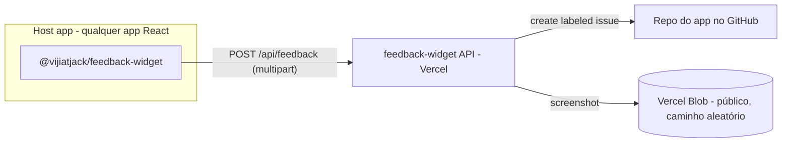

# feedback-widget

Installable React feedback widget + API that routes submissions to GitHub
issues — with an optional screenshot and basic browser context attached.

Built on Vercel + Vercel Blob + a dedicated GitHub App. No Azure dependency.



- Host apps fazem **zero mudança de backend** — instala o pacote, monta um componente.
- Um **registry** do lado da API (env var `FEEDBACK_APPS`) decide quais apps existem,
  quais origens podem chamar, qual repo recebe as issues, se o feedback está
  habilitado, e as opções de dropdown de cada app.
- Credenciais do GitHub ficam só na API (um GitHub App dedicado) — nunca no bundle do browser.

## Estrutura

- `widget/` — componente React instalável (`@vijiatjack/feedback-widget`), build via Vite.
- `api/` — API em Next.js (App Router), deploy na Vercel.
- `demo/` — app Vite simples pra testar o widget contra a API local.

## Quick start (desenvolvedores host)

```bash
npm install github:VijiatJack/feedback-widget#v0.1.0
```

```tsx
import { FeedbackWidget } from "@vijiatjack/feedback-widget";
import "@vijiatjack/feedback-widget/styles.css";

// dentro do layout autenticado:
<FeedbackWidget
  app="livia" // chave no registry
  apiBase={import.meta.env.VITE_FEEDBACK_API_BASE} // vazio em prod = widget não renderiza
  user={{ name: user.name, email: user.email, role: user.role }}
  appVersion={import.meta.env.VITE_APP_VERSION} // opcional
/>;
```

O widget não renderiza nada a menos que `apiBase` esteja definido, `user` não seja
`null`, e o registry reporte o app habilitado pra essa origem. Falha silenciosa se a
API estiver fora do ar — o host nunca quebra por causa do feedback.

### Props do widget

| Prop          | Tipo                            | Obrigatório | Descrição                                                              |
| ------------- | -------------------------------- | ----------- | ------------------------------------------------------------------------ |
| `app`         | `string`                         | sim         | Chave no registry — decide o repo alvo e as opções dos dropdowns         |
| `apiBase`     | `string`                         | sim\*       | URL base da API. Vazio/undefined = widget não renderiza nada             |
| `user`        | `{name, email, role?} \| null`   | sim         | Identidade do reporter vinda do host; `null` = widget não renderiza nada |
| `accentColor` | `string`                         | não         | Cor CSS sobrescrevendo o acento padrão                                   |
| `appVersion`  | `string`                         | não         | Versão do host app — carimbada na issue                                  |

### O que uma submissão captura

- **Entrada do usuário**: notas, tipo de feedback, escopo (_Nesta tela_ ou _Fora do
  app_ — com uma área de processo configurável por app)
- **Screenshot** (opcional): colar com Ctrl+V ou upload de arquivo (PNG/JPEG ≤ 5MB)
- **Auto-coletado**: URL da página, versão do host app (quando informada), viewport,
  timezone, user agent

> Diferente do projeto original que inspirou este (baseado em Azure), esta primeira
> versão **não** captura trilha de cliques/navegação nem console/network — é uma
> extensão natural pra uma v2 se fizer falta.

### Anatomia da issue

- Título: `[Feedback] {Tipo}: {trecho das notas}`
- Labels: `feedback`, `type:{bug|change_request|idea|question}`,
  `scope:{in-app|process}`, `app:{id}` — triagem com `label:feedback`
- Corpo: reporter, versão do app (se informada), tipo/escopo/página, notas, link do
  screenshot, tabela de dados do navegador, e um bloco JSON oculto
  `<!-- feedback-widget-metadata: {...} -->` pra ferramentas futuras

## Postura de segurança (deliberada)

Os endpoints `/api/feedback` e `/api/config` são anônimos mas **restritos por
origem, por app** (allowlist exata no registry) — o registry limita o que qualquer
chamador consegue fazer (criar issues labeladas no repo daquele app). A identidade
do reporter é afirmada pelo host — apropriado pra uma ferramenta interna de feedback.

Screenshots são blobs **públicos** no Vercel Blob com caminho aleatório (UUID) —
privacidade por obscuridade do link, não um SAS de verdade com expiração (o Vercel
Blob não oferece um equivalente que o GitHub consiga buscar anonimamente pra
renderizar a imagem embutida na issue). Se isso vier a lidar com dado sensível,
revisar esse modelo antes.

## Configuração (variáveis da API)

| Variável                     | Obrigatória | Default             | Propósito                                                          |
| ----------------------------- | ----------- | -------------------- | -------------------------------------------------------------------- |
| `GITHUB_APP_ID`                | sim         | —                    | ID numérico do GitHub App dedicado                                   |
| `GITHUB_APP_PRIVATE_KEY`       | sim         | —                    | Chave privada do App, PEM com `\n` escapado                          |
| `GITHUB_APP_INSTALLATION_ID`   | sim         | —                    | ID da instalação do App na sua conta/organização                     |
| `FEEDBACK_APPS`                | sim         | `{}` (tudo desabilitado) | O registry de apps — ver schema abaixo                          |
| `BLOB_READ_WRITE_TOKEN`        | sim (p/ screenshot) | —            | Token do Vercel Blob (gerado automaticamente ao conectar o Blob Store) |

### Schema do `FEEDBACK_APPS`

```json
{
  "livia": {
    "repo": "VijiatJack/LivIA",
    "origins": ["https://livia-alpha.vercel.app", "http://localhost:3000"],
    "enabled": true
  }
}
```

- `repo` — onde as issues são criadas; `origins` — allowlist exata de Origin;
  `enabled` — kill switch.
- `feedback_types` / `process_areas` são overrides opcionais por app dos dois
  dropdowns; omitir usa os defaults (`BUG/CHANGE_REQUEST/IDEA/QUESTION` e
  `EMAIL/DOCUMENTS/DATA/OTHER`).
- Um valor malformado falha fechado: todos os apps desabilitados, erro logado.

## Desenvolvimento local

```bash
# API
cd api
cp .env.example .env.local   # preencher credenciais do GitHub App + FEEDBACK_APPS
npm install && npm run dev    # http://localhost:3001

# Widget
cd widget
npm install && npm run build

# Demo (aponta pra API local)
cd demo
npm install && npm run dev    # http://localhost:5173
```
